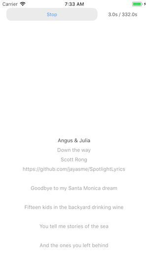
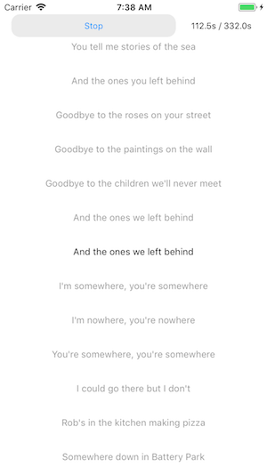

# SpotlightLyrics

---

## WARNING: This repository is still under developing!


## Introducing
`SpotlightLyrics` is a component which helps developers parsing & displaying [LRC files](https://en.wikipedia.org/wiki/LRC_(file_format)), it was completely developed under [Swift](https://github.com/Apple/Swift) language and designed for the `iOS` platform.

<figure class="half">




</figure>

## How to use
* Download or clone the repository to your local
* Copy `SpotlightLyrics.framework` from frameworks folder to the your project
* Open your project in XCode and navigate to `General` - `Linked Frameworks and Libraries` to add the component into you project

To import the `SpotlightLyrics`, just import the `SpotlightLyrics`  library in your code as usual.
```Swift
import SpotlightLyrics
```

To parse the LRC file only, just use `LyricsParser` class, do the following
```Swift
import SpotlightLyrics

... Load the lyrics string from local or remote

let parser = LyricsParser(lyrics: lyricsString)
print(parser.header.title)
print(parser.header.author)
print(parser.header.album)

print(parser.lyrics[0].lyrics)
print(parser.lyrics[0].time)
```

To display the lyrics in your view or controller, do the following
```Swift
import SpotlightLyrics

... Load the lyrics string from local or remote

let lyricsView = LyricsView()
lyricsView.frame = self.view.bounds
self.view.addSubView(lyricsView)

lyricsView.lyrics = lyricsString
lyricsView.font = UIFont.systemFont(ofSize: 13)
lyricsView.textColor = UIColor.black

// Scroll to the TimeInterval you want to highlight
lyricsView.scroll(to: 20, animated: true)
```

Also you can still add the `LyaricsView` by operating `XIB` files.

## Contributing
Due to the repository is still under developing, the issues, defects or bugs you noticed could be already known by the author and the solution is on the way or not. However, if you volunteerly participate the project, any issue or pull request is very greateful.

## Roadmap
* Finish the job
* Upload the repository to `Cocoapods`
* Keep accepting issues & pull requests to improve the repository.

## License
SpotlightLyrics is [MIT licensed](LICENSE).

## And also
Thank you!
